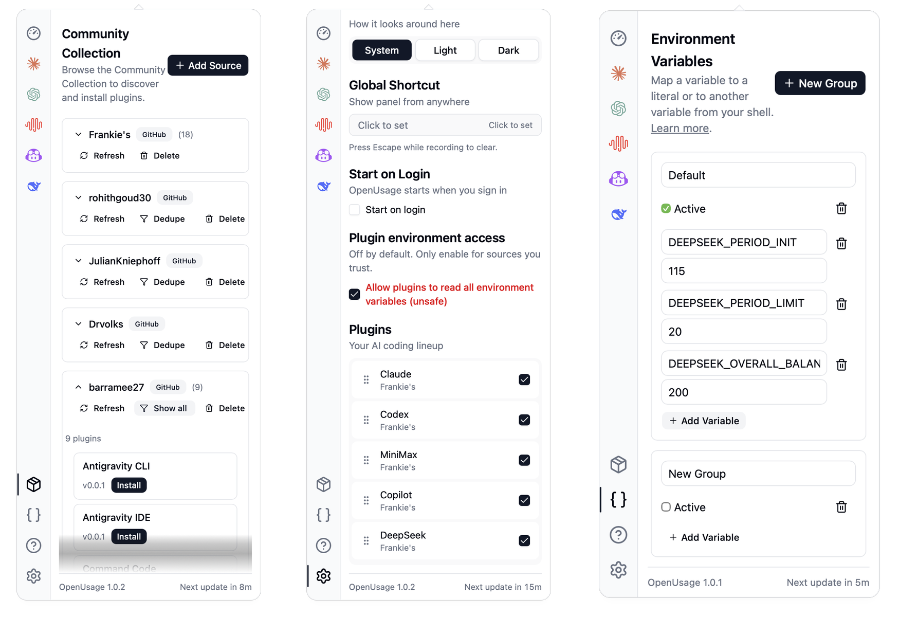

# OpenUsage.cc — Community Collection

AI subscription tracker for macOS. See usage at a glance from your menu bar.

Community-driven fork of [OpenUsage](https://github.com/robinebers/openusage) — more open, more sources, no rebuilds.

## Install

```fish
brew install --cask frankieew/openusage/openusage-cc
```

Or [download the latest release](https://github.com/FrankieeW/openusage/releases/latest).

## What makes this different

**Community Collection.** Subscribe to any plugin source — GitHub repos, git hosts, or local paths. Discover, install, and update plugins without rebuilding the app.

- **Plugin Hub.** Browse sources, pick plugins, one-click install. Hot-reloads instantly.
- **Local detection.** Existing plugins from an older install show up automatically.
- **Source-aware.** Same provider from different sources? Hub compares package hashes and warns before replacing anything.
- **Everything upstream.** All 17 providers, menu bar tracking, global shortcut, local HTTP API, proxy support.

Looking for more? See [recommended sources](docs/recommended-sources.md) for community forks that add extra providers.



## Environment Variables

Map a name to a literal value, or to another variable from your shell environment. Define groups of overrides as cards, and only active cards are applied.

See the [Env overrides guide](docs/env-overrides.md) for the full syntax (`$B` references, `$$` literal-escape, conflict behavior).

## Supported Providers

Claude, Codex, Copilot, Cursor, Devin, Grok, MiniMax, and more — [browse the collection](https://github.com/FrankieeW/openusage-collection). Want a provider that's not listed? Publish a plugin or [add a source](https://github.com/FrankieeW/openusage-collection#publishing).

## Credits

Forked from [OpenUsage](https://github.com/robinebers/openusage) by [@robinebers](https://github.com/robinebers). Built with [Tauri](https://tauri.app) + [React](https://react.dev).

## License

MIT
